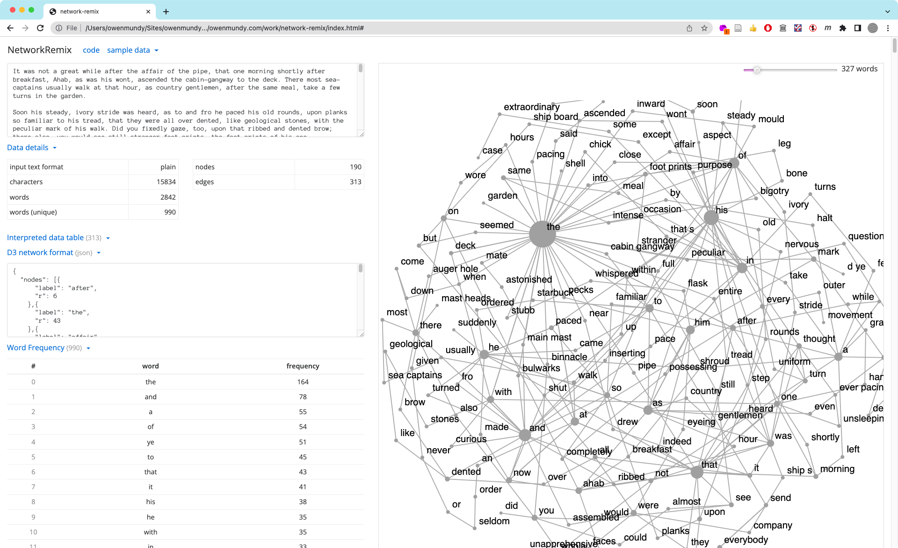

# network-remix
An interface to represent / discover relationships in text through network graph

### Credits
A project by [Eduardo Navas](https://github.com/navasse) with [Owen Mundy](https://github.com/omundy)

### License
MIT

